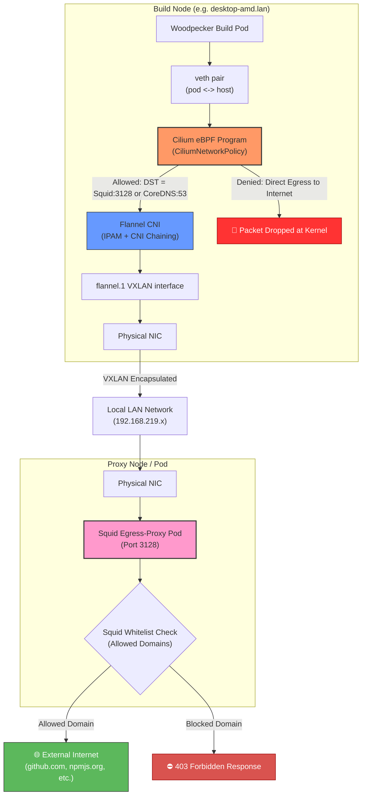

As we enter the era of AI agents, we must defend against increasingly sophisticated system attacks. A few days ago, while building my project, I suddenly became concerned about potential security threats to my site.

Upon reviewing my infrastructure, I identified a major security vulnerability in my Woodpecker build step.

My Woodpecker worker pods had unrestricted outbound access to external sites and repositories. If my AI agent or I accidentally imported a compromised library, our system could easily fall victim to a reverse shell attack.

Back when I worked as a software engineer in tech companies, strict security policies often frustrated me. The security team refused to allow build servers direct access to Maven repositories via Gradle scripts. As a junior engineer at the time, I foolishly assumed they lacked technical expertise.

Now, with 6 to 7 years of engineering experience—having served as a small part lead in team and currently running my own language study platform—I fully understand and agree with their rationale.

Below is my high-level architecture for controlling the egress traffic path using a forward proxy.

Here are the primary advantages of this approach:

Simplified Traffic Monitoring: Monitoring outbound traffic requires checking only the Squid pod.
Access Control: Effectively blocks requests to malicious or unverified external sites.

Simply put, all pods within the K3s cluster must route their traffic through the Squid proxy server (Squid).

You might wonder why I chose Cilium CNI chaining :
1. K3s uses Flannel as its default CNI.
2. Flannel lacks native packet-filtering capabilities (allow/deny/drop).
3. Cilium leverages eBPFto provide flexible, high-performance packet control.

In this setup, `Flannel` handles IPAM and routing, while `Cilium` intercepts egress packets to verify destination domains.

However, this solution is not entirely foolproof. Sophisticated attackers often exploit trusted domains such as raw.githubusercontent.com or s3.amazonaws.com—a technique known as Living off the Land (Lot) or C2 (Command & Control) infrastructure.

...Next

--- Above is what Gemini modified.--- 
 
--- Blow is what I wrote. ---

Going to AI agentic era, we should be fighting with many system attacks. A few days ago, when doing build my project, suddenly I was afraid of attacking my site.

Checking my parts of system, I have a big security hole which is woodpecker build step.

My woodpecker worker pods freely access many site, repository and etc. so if I or my agent uses hacked lirary, I could be attacked like `reverse shell`.

When I worked at Tech company, every company made me so tired. My company's security team didn't want for the build server to access mvn repository by using Gradle script. At that time, I was a freshman junior, I thought they were really no tech person.

Now I am 6~7 years software engineer, sometime I was samll part leader in my team and also now I run my own language study platform. these day I could agree why did they do that.

Below is my rough plan for egress path. I decided on forward proxy.

this is what I have thought advantages
1. A client can easily monitor traffic path.(only check Squid pod)
2. blocking accessing bad or unknown site.

... Diagram

Easily speaking, K3s cluster's all pod should pass though `Squid proxy server`.

Ah, many readers wonder why are you installing `Cilium-chaining`.
1. I uses `Flannel` as k3s default CNI
2. `Flannel` does not have the feature allow/deny/drop packet
3. `Cilium` is made by the `eBPF` which could control the packet more flexibly

In my case, `Flannel` is the CNI and do DHCP, routing... and then `Cilium` intercepts egress packet, check Domain whether is valid Domain.

But it is not perfect. Some smart hackers use `raw.githubusercontent.com`, `s3.amazonaws.com,` `gist.github.com`.. this is called as `Living off the Land(LotL)` or `C2(Command & Control)`.

...Next